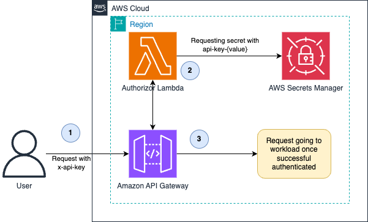

# Amazon API Gateway with AWS Lambda Authorizer and AWS Secrets Manager for API Key Authentication

This pattern demonstrates how to implement a secure API key-based authorization system using Amazon API Gateway, AWS Lambda Authorizer, and AWS Secrets Manager. Each user/tenant has their own unique API key stored in Secrets Manager, which is validated by a Lambda authorizer when requests are made to protected API endpoints.

Learn more about this pattern at Serverless Land Patterns: [https://serverlessland.com/patterns/apigw-secretsmanager-apikey-cdk](https://serverlessland.com/patterns/apigw-secretsmanager-apikey-cdk)

Important: this application uses various AWS services and there are costs associated with these services after the Free Tier usage - please see the [AWS Pricing page](https://aws.amazon.com/pricing/) for details. You are responsible for any AWS costs incurred. No warranty is implied in this example.

## Requirements

* [Create an AWS account](https://portal.aws.amazon.com/gp/aws/developer/registration/index.html) if you do not already have one and log in. The IAM user that you use must have sufficient permissions to make necessary AWS service calls and manage AWS resources.
* [AWS CLI](https://docs.aws.amazon.com/cli/latest/userguide/install-cliv2.html) installed and configured
* [Git](https://git-scm.com/book/en/v2/Getting-Started-Installing-Git) installed
* [Node.js and npm](https://nodejs.org/) installed
* [AWS CDK](https://docs.aws.amazon.com/cdk/latest/guide/getting_started.html) installed

## Deployment Instructions

1. Create a new directory, navigate to that directory in a terminal and clone the GitHub repository:
    ```
    git clone https://github.com/aws-samples/serverless-patterns
    ```
1. Change directory to the pattern directory:
    ```
    cd apigw-secretsmanager-apikey-cdk
    ```
1. From the command line, use AWS SAM to deploy the AWS resources for the pattern as specified in the template.yml file:
    ```
    npm install
    ```
1. Deploy the stack:
    ```
    cdk deploy
    ```

Note the outputs from the CDK deployment process. The output will include the API Gateway URL you'll need for testing.

## How it works



1. Client makes a request to the API with an API key in the `x-api-key` header
2. API Gateway forwards the authorization request to the Lambda Authorizer
  - The Lambda Authorizer checks if the API key exists in Secrets Manager
  - If the key is valid, the associated tenant information is retrieved and included in the authorization context
3. The API Gateway then allows or denies access to the protected endpoint based on the policy returned by the authorizer

Each API key in Secrets Manager should follow the naming convention `api-key-{keyvalue}` and contain a JSON document with at least a tenantId field.

## Testing

1. Create a new api key, you will need the api key later on
    ```
    ❯ ./create_api_key.sh sample-tenant
    API key for tenant sample-tenant created: b4037c9368990982ac5d1c670053bf76
    ```
1. Get the API Gateway URL from the deployment output:
    ```bash
    # The output will be similar to
    ApigwSecretsmanagerApikeyCdkStack.ApiUrl = https://383rm6ue91.execute-api.us-east-1.amazonaws.com/prod/
    ```
1. Make a request to the protected endpoint with a valid API key:
    ```
    curl -H "x-api-key: CREATED_API_KEY" https://REPLACE_WITH_URL_FROM_CDK_OUTPUT.amazonaws.com/prod/protected
    ```
    If successful, you should receive a response like:
    ```
    { "message": "Access granted" }
    ```
1. Try with an invalid API key:
    ```
    curl -H "x-api-key: invalid-key" https://REPLACE_WITH_URL_FROM_CDK_OUTPUT.amazonaws.com/prod/protected
    ```
    You should receive an unauthorized error.
1. Try without an API key:
    ```
    curl https://REPLACE_WITH_URL_FROM_CDK_OUTPUT.amazonaws.com/prod/protected
    ```
    You should also receive an unauthorized error.


## Cleanup

1. Delete the stack
    ```bash
    cdk destroy
    ```
1. Delete created SecretManager keys using
    ```bash
    ./remove_secrets.sh

    # to check which keys will be removed, use the dry-run option
    ./remove_secrets.sh --dry-run
    ```

----
Copyright 2024 Amazon.com, Inc. or its affiliates. All Rights Reserved.

SPDX-License-Identifier: MIT-0
