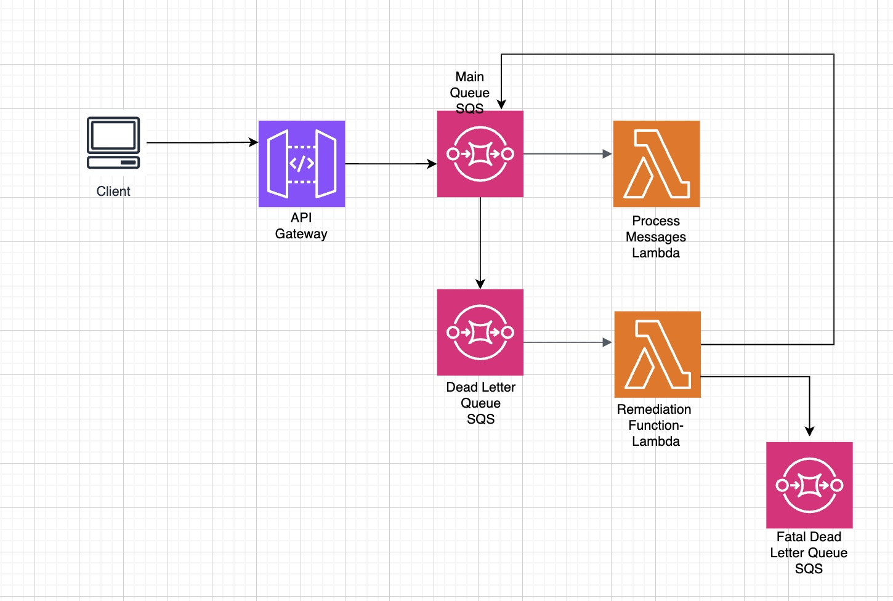

# Serverless Message Processing Pattern

## Overview
An adaptable pattern for message processing using AWS serverless services, featuring error handling and automatic recovery mechanisms.

## Core Components
- Amazon API Gateway (message ingestion)
- Amazon SQS Queues (main + DLQs)
- Lambda Functions (processing + recovery)


## Architecture Diagram




## Basic Flow
1. Messages enter through API Gateway
2. Main queue receives messages
3. Lambda function polls the main queue using Event Source Mappings (ESMs) and handles the messages. 
   Read more about how Lambda synchronously processes queue messages in this [documentation.](https://docs.aws.amazon.com/lambda/latest/dg/with-sqs.html)
4. Failed messages route to DLQs -In this case a failed message would be a malformed email, however this can be adapted to other use cases.
5. Decision maker attempts an automated recovery -In this sample, we remediate common email malform issues including whitespace and typos in domain extensions.

## Deployment
# Build the SAM application

1. Create a new directory, navigate to that directory in a terminal and clone the GitHub repository:
    ``` 
    git clone https://github.com/aws-samples/serverless-patterns
    ```
2. Change directory to the pattern directory:
    ```
    cd serverless-patterns/serverless-messaging-redrive
    ```

# Build the SAM application
The ```sam build ``` command prepares an application for subsequent steps in the developer workflow, such as local testing or deploying to AWS.

   ```
sam build
   ```
# Deploy the application
The ```sam deploy``` command deploys an application to the AWS Cloud using AWS CloudFormation. The ```--guided``` option is to have the AWS SAM CLI use prompts to guide you through the deployment.

   ```
sam deploy --guided
   ```

## Key Features
- Automatic retry mechanism
- Segregation of recoverable/fatal errors
- Processing logic with the potential for points of adaptation

## API Reference
# Send Message

The following is an example API call that you can try with your own endpoint.

   ```

curl -X POST \
  'https://\${endpoint}/prod/message' \
  -H 'Content-Type: application/json' \
  -d '{
                "messageId": "test-456",
                "messageType": "TYPE_A",
                "payload": {
                    "email": "user@example.com",
                    "data": "some data"
                },
                "timestamp": "2023-11-22T12:00:00Z"
            }'
   ```


## Adaptation Points
- Message validation rules
- Processing logic
- Error handling strategies
- Recovery mechanisms
- Monitoring requirements
- API Design

## Cleanup
1. Delete the SAM template
```
sam delete
```
2. Confirm the stack has been deleted
```
aws cloudformation list-stacks --query "StackSummaries[?contains(StackName,'STACK_NAME')].StackStatus"
```